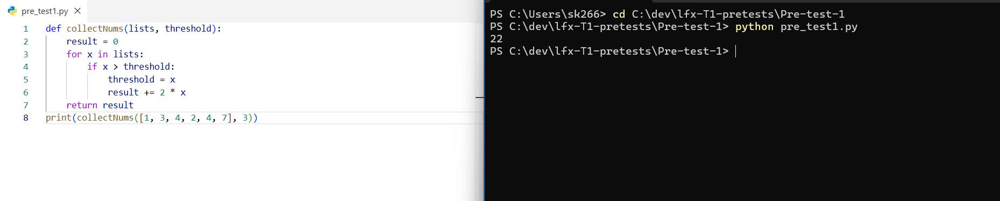

# LFX Mentorship Pre-test 1: Python Logic Implementation

This folder contains the solution for the first pre-test requirement, demonstrating a Python implementation of the `collectNums` algorithm.

## 📷 Execution Output



## 🛠️ Technical Detail
The script `pre_test1.py` processes a list of integers with a dynamic threshold.

**Logic Breakdown:**
1.  Iterate through the input list `[1, 3, 4, 2, 4, 7]`.
2.  If a number `x` exceeds the current `threshold` (initially 3), it updates the threshold to `x`.
3.  The result accumulates `2 * x` for every qualifying number.
4.  **Final Output:** `22` (Derived from inputs 4 and 7).

## 💻 How to Run
```bash
python pre_test1.py
