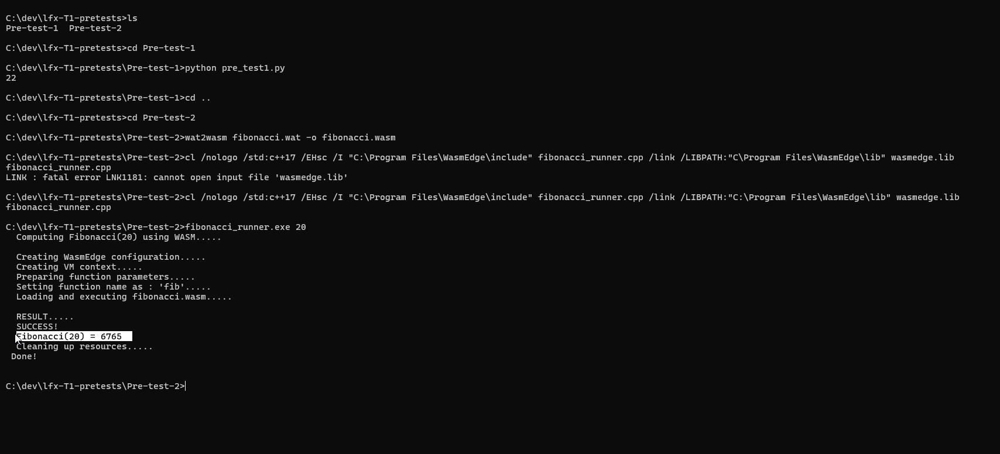

# LFX Mentorship Pre-test 2: WasmEdge C API Implementation

This project is a solution for the **WasmEdge CLI Tool Extension** pre-test. It implements a C++ program that utilizes the WasmEdge C API to load, validate, and execute a WebAssembly module, effectively replicating the behavior of the `wasmedge run` CLI command.

## 🎥 Solution Videos & Results

I have implemented and verified the solution using CMake.

### Video solution
- [▶️ Watch solution of Pre-test-2 Video](https://drive.google.com/file/d/13X6APhNHOgMwUuN-Fxb8BHtnRvnR-DYP/view?usp=sharing)

**Execution Output:**


---


## 🚀 How to Build & Run

**ℹ️ Note:** The compiled `fibonacci.wasm` file is **already attached** in this repository. You do NOT need to compile the source `.wat` file manually.

### Option 1: Using CMake (Recommended)
This method automatically handles dependencies and places the WASM file correctly.

```bash
mkdir build
cd build
cmake ..
cmake --build . --config Release

```
**Run the Application**

Windows
```bash
.\Release\fibonacci_runner.exe 10

```

Linux / macOS
```bash
./fibonacci_runner 10

```
### Option 2: Manual Compilation
If you compiled the project manually (as shown in the video), ensure the `fibonacci.wasm` file is in the same directory as your executable, then run:

```bash
# Run the executable generated from the manual build
.\fibonacci_runner.exe 10
```
