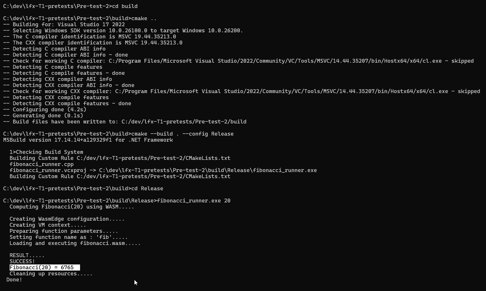

# LFX Mentorship Pre-test 2: WasmEdge C API Implementation

This project is a solution for the **WasmEdge CLI Tool Extension** pre-test. It implements a C++ program that utilizes the WasmEdge C API to load, validate, and execute a WebAssembly module, effectively replicating the behavior of the `wasmedge run` CLI command.

## 🎥 Solution Videos & Results

I have implemented and verified the solution using two different build methods.

### 1. Manual Compilation
*Direct compilation using `MSVC` without a build system. Output of Pre-test-1 is also included in this video.*
- [▶️ Watch Manual Compilation Video](https://drive.google.com/file/d/1i3bbZa1H_WCdEywAL0OfiHGC_rsiZRtK/view?usp=sharing)

**Execution Output:**

---

### 2. Compilation Using CMake
*Automated build configuration using `CMakeLists.txt`.*
- [▶️ Watch CMake Solution Video](https://drive.google.com/file/d/1kDI_A1G2MrZQ-tMk0pVSJXMEqA6D5QSA/view?usp=sharing)

**Execution Output:**

## 📝 Summary
I have successfully completed Pre-test 2 by implementing the WasmEdge runner and verifying it **in both ways** (Manual Compilation and CMake). The output demonstrates the correct execution of the Fibonacci WASM module using the WasmEdge VM API.